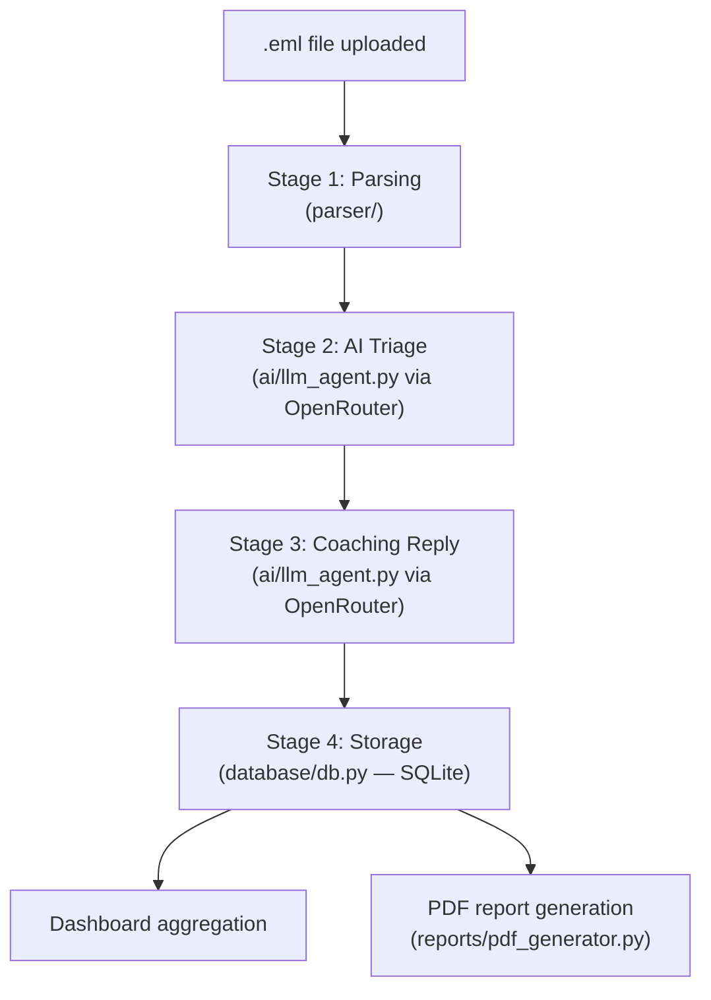
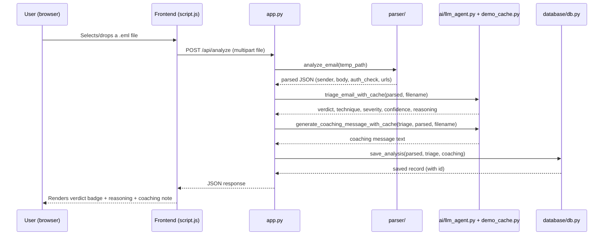
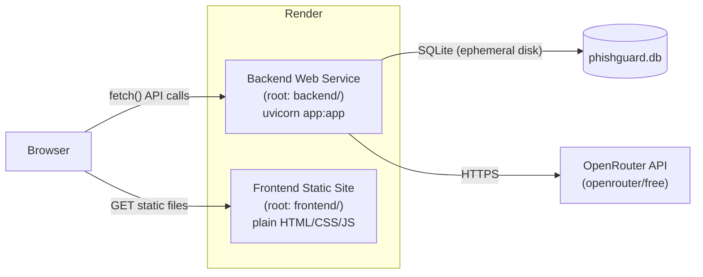

# PhishGuard — Architecture

Technical reference for the system design. For the narrative writeup (problem
statement, methodology, results, evaluation), see `docs/project_report.md`.

---

## 1. High-level pipeline



Each stage's output is the next stage's input — Stage 1's deterministic JSON
feeds directly into the Stage 2 prompt, Stage 2's verdict feeds into the
Stage 3 coaching prompt, and the combined result of all three is what gets
persisted in Stage 4.

---

## 2. Component breakdown

```
backend/
├── app.py                  FastAPI app — wires all stages behind REST endpoints
│
├── parser/                 STAGE 1 — deterministic, no LLM involved
│   ├── email_parser.py     Parses .eml -> sender, subject, body, attachments
│   ├── header_analysis.py  Reads SPF/DKIM/DMARC results from mail headers
│   └── url_extractor.py    Extracts URLs, flags shorteners/IP/lookalikes
│
├── ai/                     STAGE 2 + 3 — LLM reasoning via OpenRouter
│   ├── prompts.py           Prompt templates (triage + coaching)
│   ├── llm_agent.py          API calls, retries, validation, fallback
│   └── demo_cache.py         Pre-verified fallback results for demo reliability
│
├── database/                STAGE 4 (storage)
│   ├── models.py             SQLAlchemy schema (EmailAnalysis table)
│   └── db.py                  Connection, save/query, dashboard aggregation
│
└── reports/                 STAGE 4 (reporting)
    └── pdf_generator.py       Per-incident PDF export (ReportLab)

frontend/
├── index.html                Upload / Results / Dashboard tabs
├── style.css                  Design tokens + layout
└── script.js                   Calls the backend API, renders results + charts
```

---

## 3. Request flow: uploading an email



If Stage 2 fails after retries (API down, rate-limited, invalid response), the
pipeline does **not** crash — it returns a result flagged
`manual_review_required: true`, and Stage 3 short-circuits to a safe fallback
message instead of attempting a second doomed API call.

---

## 4. API reference

| Method | Endpoint | Purpose |
|---|---|---|
| `GET` | `/` | Health check |
| `POST` | `/api/analyze` | Upload a `.eml` file, runs the full 4-stage pipeline, returns the saved record |
| `GET` | `/api/analyses` | List all stored analyses, most recent first |
| `GET` | `/api/analyses/{id}` | Get one analysis by ID |
| `GET` | `/api/analyses/{id}/report` | Generate and download that analysis as a PDF |
| `GET` | `/api/dashboard` | Aggregated stats: verdict counts, top techniques, trend over time |

---

## 5. Database schema

Single table, `email_analysis` (see `database/models.py`):

| Column | Type | Notes |
|---|---|---|
| `id` | Integer (PK) | Auto-increment |
| `sender` | String | From Stage 1 |
| `subject` | String | From Stage 1 |
| `department` | String (nullable) | Not currently wired to any UI input |
| `verdict` | String | `phishing` / `suspicious` / `legitimate` |
| `technique` | String | e.g. `urgency_pressure`, `business_email_compromise` |
| `severity` | String | `low` / `medium` / `high` / `critical` |
| `confidence` | Float | 0.0–1.0 |
| `reasoning` | String | Model's explanation |
| `manual_review_required` | Boolean | `True` if Stage 2 fell back |
| `coaching_message` | String | Stage 3 output |
| `analyzed_at` | DateTime (UTC) | Set automatically on insert |

Kept as one flat table rather than a normalized multi-table design — at this
project's scale, a single table is simpler to query for dashboard
aggregation than joining across tables would be.

---

## 6. Deployment architecture



Backend and frontend are deployed as **two independent Render services**
from the same GitHub repo (different root directories), so either can
redeploy without affecting the other. The database has no persistent disk on
Render's free tier — it resets on every redeploy or idle-timeout restart,
which is expected behavior for this deployment tier (see
`docs/project_report.md`, Limitations, for the production alternative).

---

## 7. Design principle: deterministic checks vs. AI reasoning

A recurring theme across the codebase: anything with a ground-truth correct
answer is computed in Python, never left to the LLM to "decide."

| Determined by Python (never re-evaluated by the LLM) | Determined by the LLM |
|---|---|
| SPF / DKIM / DMARC pass-fail | Which social-engineering technique is being used |
| Whether a URL is shortened / IP-based / lookalike | Overall severity |
| Whether a field parses successfully | Confidence in the verdict |
| — | Plain-language reasoning and coaching text |

This split is why the Stage 2 prompt (`ai/prompts.py`) explicitly instructs
the model not to re-derive facts already provided — it only reasons on top
of them.